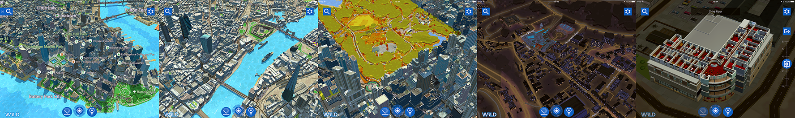

# eeGeo Example App

* [Support](#support)
* [Getting Started](#getting-started)
    * [eeGeo API Key](#eegeo-api-key)
    * [Optional Steps](#optional-steps)
* [Features](#features)
* [SDK Documentation](#sdk-documentation)
* [License](#support)

This example app showcases the [eeGeo SDK](http://www.eegeo.com/), a cross-platform, OpenGL-based library for displaying beautiful and engaging 3D maps.

### What does the eeGeo mapping platform have to offer?

* Detailed 3D coverage for the whole of Canada, Great Britain, the United States, and more
* Indoor maps in full 3D
* Flexible themes, allowing you to change the style of your map
* Customisable pins and markers
* Support for custom 3D models and animation
* Compatibility with iOS, Android, Windows, and OS X
* Continuous deployment, meaning you get the latest features as they're developed

Download our app, [Recce](https://www.eegeo.com/recce/), on Google Play or the App Store to see what the eeGeo SDK can do. Or [read on](#getting-started) to build the app yourself.

## Support

If you have any questions, bug reports, or feature requests, feel free to submit to the [issue tracker](https://github.com/eegeo/eegeo-example-app/issues) for this repository.

## Getting Started

This example app demonstrates the use of the eeGeo SDK to display beautiful 3D maps on iOS, Android, and Windows PCs. It can be used as the basis for your own app, or can be used as a reference when integrating eeGeo's maps into an existing app.

The eeGeo SDK is distributed as a C++ static library with headers. Most of this example application is also written in C++ and shared between platforms to reduce code duplication.

This section will walk you through the process of getting up and running quickly on each platform.

1.  Clone this repo: `git clone https://github.com/eegeo/eegeo-example-app`
2.  Obtain an [eeGeo API key](https://www.eegeo.com/developers/apikeys) and place it in the configuration file for the platform you are building:
    * [iOS app config](https://github.com/eegeo/eegeo-example-app/blob/master/ios/Resources/ApplicationConfigs/standard_config.json#L3).
    * [Android app config](https://github.com/eegeo/eegeo-example-app/blob/master/android/assets/ApplicationConfigs/standard_config.json#L3).
    * [Windows app config](https://github.com/eegeo/eegeo-example-app/blob/master/windows/Resources/ApplicationConfigs/standard_config.json#L3).
3.  Choose a platform from the table below to see detailed instructions for building the app.

Platform                                        | Languages         | UI 
------------------------------------------------|-------------------|-------------
[Getting started on Android](/android#readme)   | C++, Java         | Android UI
[Getting started on iOS](/ios#readme)           | C++, Objective-C  | Cocoa Touch
[Getting started on Windows](/windows#readme)   | C++, C#           | WPF

### eeGeo API Key 

In order to use the eeGeo 3D Maps SDK, you must sign up for a free developer account at https://www.eegeo.com/developers. After signing up, you'll be able to create an [API key](https://www.eegeo.com/developers/apikeys) for your apps. 

To run this example app, you must place the API key in the application configuration file for each of the platforms you are building, specifying the value of "EegeoApiKey":
* [iOS app config](https://github.com/eegeo/eegeo-example-app/blob/master/ios/Resources/ApplicationConfigs/standard_config.json#L3).
* [Android app config](https://github.com/eegeo/eegeo-example-app/blob/master/android/assets/ApplicationConfigs/standard_config.json#L3).
* [Windows app config](https://github.com/eegeo/eegeo-example-app/blob/master/windows/Resources/ApplicationConfigs/standard_config.json#L3).

If you are creating a new app, or integrating eeGeo 3D Maps into an existing app, the API key should be passed as the first argument to the constructor of [EegeoWorld](http://cdn1.eegeo.com/docs/mobile-sdk/class_eegeo_1_1_eegeo_world.html).

### Optional Steps

This app uses third-party search service providers to allow users to search for places like caf&eacute;s, restaurants, and bars and have the results show up on the map. To enable this, you will to supply the credentials for those services.

1.  Obtain [Yelp credentials](https://www.yelp.com/developers) to enable Yelp search results in the app. Place them in the application config file appropriate for the platform you are building:
    * [iOS app config](https://github.com/eegeo/eegeo-example-app/blob/master/ios/Resources/ApplicationConfigs/standard_config.json#L12-L15).
    * [Android app config](https://github.com/eegeo/eegeo-example-app/blob/master/android/assets/ApplicationConfigs/standard_config.json#L12-L15).
    * [Windows app config](https://github.com/eegeo/eegeo-example-app/blob/master/windows/Resources/ApplicationConfigs/standard_config.json#L12-L15).
2.  Obtain a [GeoNames username](http://www.geonames.org/login) to enable GeoNames search results in the app. Place it in the application config file appropriate for the platform you are building:
    * [iOS app config](https://github.com/eegeo/eegeo-example-app/blob/master/ios/Resources/ApplicationConfigs/standard_config.json#L16).
    * [Android app config](https://github.com/eegeo/eegeo-example-app/blob/master/android/assets/ApplicationConfigs/standard_config.json#L16).
    * [Windows app config](https://github.com/eegeo/eegeo-example-app/blob/master/windows/Resources/ApplicationConfigs/standard_config.json#L16).

## Features

The [eeGeo Example App](https://github.com/eegeo/eegeo-example-app) demonstrates a variety of SDK features and is a good starting point to learn how the SDK works.

See [here](https://www.eegeo.com/features/) to learn more about what the eeGeo SDK has to offer.

## SDK Documentation

See the [eeGeo API reference](http://cdn1.eegeo.com/docs/mobile-sdk/namespaces.html) for documentation on the individual SDK types.

## License

The eeGeo 3D Maps Example App is released under the Simplified BSD License. See the [LICENSE.md](https://github.com/eegeo/eegeo-example-app/blob/master/LICENSE.md) file for details.
